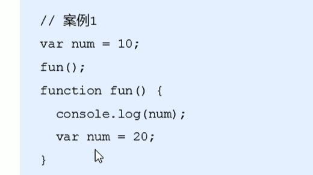
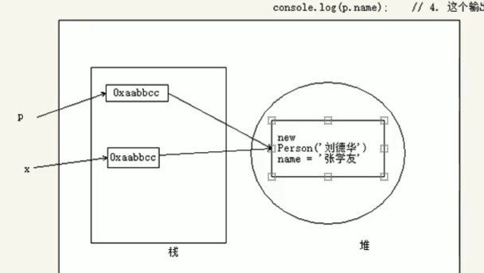
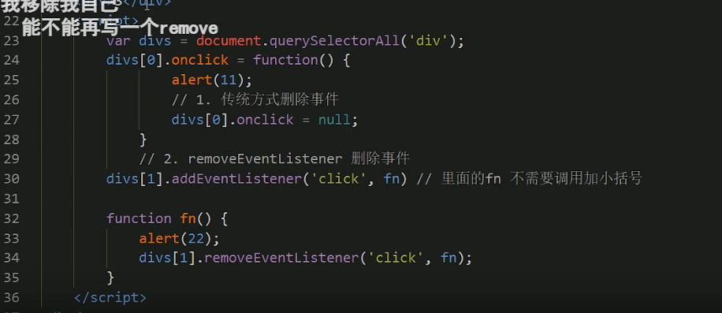

## 变量
1. var age; 变量的声明
2. age = 10;变量的赋值
3. 变量的初始化：var age = 'pink老师';
4. - var myname = prompt('请输入你的名字：');
   - alert(myname);
5. 多个：var age = 18,adress = '界牌';
6. - var sex;只是定义没有赋值，返回undefind
   - 不定义直接引用，报错
   - 不声明，直接age =10 ,不推荐使用。
7. 区分大小写，不能以数字开头，不能是关键字保留字，变量尽量有意义，驼峰写法--开头小写，后面的单词首字母大写：myFirstName
8. name不是关键字，不是保留字，但是在浏览器有特殊的意义
## 数据类型
1. 不同数据类型占用内存的空间不一样，所以要区分数据类型
2. js中变量是程序在运行过程中根据右边的值确定的
3. js是动态类型，变量运行过程中可以变化数据类型
   - var x =10;
   - x = 'mary';
4. 简单数据类型
   - Number
      * 数字前面+0-----8进制
      * +0x------ 16进制
      * 输出默认是10进制
      * 数字的最大值Numbe.MAX_VALUE
      * Numbe.MIN_VALUE
      * Infinity
      * -Infinty 无穷小
      * NaN--不是数字
      *  ```isNaN(10)```
   - Boolean
      * true false true参与加法运算是1，false是0 
   - String
      * \n换行符
      * \\ 斜杠\
      *  \'
      *  \"
      *  \t
      *  \b 空格
      *   lenth属性:```str.lenth```
      *   拼接：str + str(数值类型也可以);12+'12' = 1212
      *   ```'老师'+age+'岁';```
   - Undefined var a;声明了但是没有赋值
      * undfine+1=NaN
      *  undfine+LAOSHI=undfineLAOSHI
   - Null------var a = null;
      * 'nihao'+null = nihaonull
      * 1+null =1
6. 获取数据类型
   - ```typeof 变量名字```判断数据类型
7. 转换数据类型
8. - -------转为将字符串---------
   - 变量名.toString()
   - String(变量名)
   - 变量+'字符串'
   - -------将字符串转为为数值型---------
   - parseInt('整数')
   - parseFloat('浮点数')
   - Number('12')---强制转换为数值型
   - 隐式转换---利用算数运算转化----'12'-0;
   - -------转化为Boolean型---------
   - Boolean('变量')
9. 标识符：变量，属性，函数，参数取的名字
10. 关键字：break,case,continue,if,else.....
11. 保留字：boolean,byte,class.....现在不是关键字，未来是关键字
## 运算符
1. 运算符
    - 也叫操作符，用于赋值、比较、运算
    - 算术运算符
        * +，-，*，/,%
        * 不要直接用小数参与运算，会有精度问题
    - 表达式和返回值
    - 递增和递减运算符
        * num++;num--;后置递增减
        * ++num;--num;前置递增减
        * 后置递增先返回原来的值，再+1：原来的值参与运算，后面再+1
        * 前置递增就是直接上来就+1
        * 后置和其他变量一起运算时，就有区别
        * 单独一行运用没啥区别
    - 比较运算符（关系运算符）
        * 大于和小于，大于等于，小于等于
        * == 会自动转换两边的类型  '18' == 18;true
        * ！= 不等
        * ==== 全等 '18' == 18;false,  ！== 不全等
    - 逻辑运算符（布尔运算符）
        * && 逻辑与
        * || 逻辑或
        * ！逻辑非
        * 逻辑中断：左边的表达式1可以确定，右边的表达式就**不运算**（表达式2-表达式2-表达式3-表达式4）
        * 逻辑与短路运算：第一个表达式为真，返回第二个表达式值；第一个达表式为假，返回0（空或者假 null NaN undfined）
        * 逻辑或短路运算：如果表达式1为真，则返回表达式1；如果表达式1为假，则返回表达式2（依次）。
  
    - 赋值运算符
        * = 直接赋值
        * +=，-=
        * *=、/=、%=
    - 运算符优先级
        * 一元运算符 ++ --- ！(逻辑非优先级很高)
        * 算数运算符 先* / %后 + -
        * 关系运算符 大于 大于等于 小于 小于等于
        * 相等运算符 == != ==== !==
        * 逻辑运算符 先&&后||
        * 赋值运算符 =
        * 逗号运算符 ,
## 流程控制和分支结构
1. 控制代码的执行顺序
2. 顺序结构
3. 分支结构（多选一）
    - 双分支语句：if      else 二选一会执行
    - 多分支语句：if      else if(可以写多个)     else 
    - 三元表达式：var result = 条件表达式？表达式1：表达式2 
    - ``` javascript
        switch(表达式){
            case value1:
                执行语句1；
                break;
            case value2:
                执行语句2；
                break;
            default:
                执行最后的语句；
        }
    ```\
4. switch效率更高，判断固定值用switch;判断范围用if else
## 循环结构
1. for循环：初始化变量 判断表达式 操作表达式
    ```javascript
        for (var i =0;i<100;i++){
            console.log(msg)
        }
    ```\
2. 打断点：观察程序的执行过程chrome浏览器的Sources查看
3. while 适合条件比较复杂的情况 
    ```javascript
        while(num<100){
            console.log('好啊')
            num++
        }
    ```\
4. do while  先执行一次循环体，再判断条件
    ```javascript
        do{
            console.log('how are you ')
        }while(i<=100)
    ```\
5. continue 
    ```javascript
        for(var i = 1;i<=5;i++){
            if (i==3){
                continue;
            }
            console.log('不要输出3')
        }
    ```\
6. break直接跳出循环

## js规范
1. 变量有意义
2. 注意空格
## 数组
1. 提供一组数据的存储，并提供方便的访问，存储在单个变量下
2. 注意的是数组里面可以放任意的数组类型
3. 创建数组：
    1. new 
        - var arr = new Array();
    2. 数组字面量创建数组 
        - var arr = [1,2,'pink老师',true] 
4. 获取数组元素：
    1. 数组下标从0开始
    2. 通过索引获取：arr[2];
5. 遍历数组：
    1. for 循环
    2. 数组长度 arr.lenth
6. 数组新增元素：
    1. 修改lenth长度 ar.lenth = 5;(原来为3个，修改为5个，新增的默认为undfined)
    2. arr[4] = '鲜国川';直接在原来3个的基础上追加
    3. arr = '有点意思'; //直接给数组名赋值，会直接替换掉原来的值
## 函数导读
1. 封装了一段重复调用的代码
2. 声明函数和调用函数
    ``` javascript
        function 函数名(){
            console.log('调用才能执行')
        }
        //调用函数  函数名();
    ```\
3. 函数的参数:形参和实参(控制函数功能的多样性)
    ```javascript
        function cook(形参1,形参2...){
            pass
        }
        cook(实参1,实参);
    ```\
4. 实参和形参个数的匹配问题:
    1. 个数一致，则正常的输出
    2. 实参>形参 ，放弃多于的实参个数
    3. 实参<形参，多于形参的默认为undfined
5. 函数的返回值
    ```javascript
    function cook(形参1,形参2...){
        return 需要返回的结果;
    }
    cook(实参1,实参);
    ```\
6. return返回值之后，函数终止运行；只能返回一个值
7. 如果函数没有return,则是返回的undfined
8. arguments的作用：存储了函数传递的实参，不用写形参数,只有函数才能用这个对象。不知道用户输入的实参的情况下用这个
    ```javascript
        function cook(){
            return arguments;
            返回的是一个伪数组（有数组的长度属性，可以索引，没有数组的pop和push等）
        }
        cook(实参1,实参...);
    ```\
9.  函数可以调用另外一个函数;
10. 函数表达式(匿名函数)创建函数：
    var 变量名 = fuction(){};
    var fun = function(){
        console.log('我是函数表达式');
    }
    fun();

## 作用域
1. 代码在某个范围内起作用域
2. 全局作用域，在函数内部就是局部作用域
3. 全局变量：全局都能用，包括函数的内部。函数内部的称为局部变量，**如果在函数没有声明直接赋值的也叫全局变量**。
4. 全局变量关闭浏览器才会被释放，局部变量在函数结束时被释放。
5. 块级作用域{}（es6才新增的块级作用域）
6. 作用域链：函数中有函数，内部函数访问外部函数的变量查找的方式（就近原则）

## js预解析
1. 预解析和代码执行
2. js会把所有的声明变量和函数提升到当前作用域的最前面
3. 预解析：
   - 变量预解析：把变量的提升到当前（函数内外）的作用域，**不对变量赋值**。
   - 函数提升：把函数提升到当前（函数内外）的作用域，**不对函数赋值**。
   - 

## js对象
1. js是属性和方法的集合，属性是事物的特征，方法是对象的行为。
2. 创建对象的三种方式：
    1. 字面量创建
        ```javascript
           // var obj = {} 花括号创建对象
            var person = {
                zhname:'张安丰'
                age:18,
                sayhi:function(){
                    console.log('hi')
                }//匿名函数
            }
            //调用person.name person['age']  person.sayhi(); 
        ```\
    2. new的创建
        ``` javascript
             var obj = new Object();
             obj.zhname = '张哈;
             obj.sayhai = function(){
                 console.log('hi');
             }
        ```\
    3. 构造方法创建
        ``` javascript
            function Star(uname,age,sex){//构造函数必须大写
                this.name = uname;
                this.age = age;
                this.sex = sex;
                this.sing = function(song){
                    console.log(song);
                }
            }
            var dh = new Star('刘德华',18,'男');//返回的是一个对象
            dh.sing('冰雨');
            //调用构造函数必须用new 
        ```\
3. 对象的属性不用声明，函数是单独存在方法是对象里面的
4. 利用构造函数创建对象的过程叫实例化，对象==实例；构造函数==类
5. new Star 是创建一个空对象，然后用this指向这个对象，然后赋值并返回。
6. 属性的遍历：
   1. for  in 
    ```javascript
        for (var k in obj){
            console.log(k);//得到属性名
            boj[k]//得到属性值
        }
    ```\
7. 对象也是一类数据类型，对象是实例。
## 内置对象
1. js的对象分为自定义对象、内置对象、浏览器对象
2. 查文档：MDN
3. Math对象：**math不是一个构造函数，不需要new，直接使用就行**
   - Math.max(2,3,10)    //10
   - 封装自己数学对象：
   - var myMath{
       PI:3.1415926;
       max:function(){
           ****
       }
   }
   myMath.max(1,2,3)
   - 随机数：Math.random();返回的是0-1之间的小数
4. Date对象:**是一个构造函数，必须用new来创建**
    ```javascript
            var date = new Date();//返回当前的时间
            var date = newn Date('2022-5-1')
            date.getFullYear(); //返回的是年
            date.getMonth() + 1;//实际返回的小一个
            date.now()从新在开始到1970、1、1的总的毫秒数（时间戳）
            //倒计时：将来的时间戳-现在的是按戳
            function conutDown(time){
                var nowTime = +newDate();//现在时间的时间戳
                var inputTime = +newDate(time);//输入时间的时间戳
                var times = (inputTime - nowTime) / 1000;//将秒转化为毫秒
            }
    ```\ 
5. 数组对象
    ```javascript
        var arr1 = new Array(2) //创建的长度为2的空数组
        arr instanceof Array//判断是否是一个数组
        Array.isArray(arr)//判断是否是一个数组
        arr.push(1,1)//在数组的末尾添加一个或者多个元素，返回数组的长度
        arr.unshift(1,3)//在数组的前面添加一个或者多个元素，返回数组的长度
        arr.pop()//在数组的末尾删除一个元素，返回删除元素的值，无参数
        arr.shfit()//删除数组第一个元素，返回删除的那个值，无参数
        var arr = [6,1,3,5,6]
        arr.reverse();
        arr.sort(function(a,b){
            return a - b;//升序 b - a 就是降序
        });
        arr.indexof(元素值)//求出索引值，只返回满足第一个条件的索引，找不到就返回-1
        arr.lastIndexOf(元素值)//从后面开始查找，找不到返回-1
        //去除掉数组中重复的元素
        function unarr(arr){
            var newArray = [];
            for (var i ;i<arr.lenth; i++){
                if(newArray.indexof(arrr[i] == -1)){
                    newArray.push(arr[i]);
                }
            }
            return newArray;
        }
        //数组转化字符串两种方法
        arr.toString();
        arr.join('-');
    ```\ 
## 基本包装类型
1. 数值、布尔、字符串三种包装数据类型
    ```javascript
        var str  = 'andy';
        str.length//为啥会有lenth属性值。下面是包装的步骤：将简单的数据类型包装为复杂的数据类型
        ----------------
        var temp  = new String('andy');
        str  = temp;
        temp = null;
        ----------------
    ```\
## 字符串数据对象
1. 指的是里面的值不可变，虽然看上去变了，但是实际上是在内存中新开辟了一个空间。
    ```javascript
        str.indexof('春天',3)//从3号开始查找春天，返回位置
        str.charAt(index)//返回指定位置的字符
        str.charCodeAt(index)//返回ASCii值
        str[index]//返回index对应的值
        str.concat('josij')//连接操作
        str.substr(start,lenth)//从什么地方取，取什么
        str.replace('a','b')//只会替换第一个a
        str.split('-')//'12-12-23'----[12,12,23]字符串转化为数组
    ```\
## 简单数据类型和复杂数据类型
1. 简单数据类型：string,number,boolean,null(类型是object，历史遗留问题，空对象),undefined
2. Object,Array,Datde....
3. 简单数据类型的值放在栈里面，复杂数据类型的值放在堆立面（复杂数据类型的地址放在栈里面）
4. 
5. **简单数据类型传递的时候是传递的值，复杂数据类型传递的是地址**

## Web APIs 
1. Web APIs主要学习DOM和BOM
2. Web APIs是JS独有的部分
3. API:给程序员提供的一种功能，以便轻松的实现功能
4. Web APIs：浏览器功能（BOM）和页面元素（DOM）
   
## DOM
1. DOM是处理html和xml页面的接口,改变网页的结构、样式
2. 文档(document)：一个页面，元素(element)：所有标签，节点(node)：所有内容都是节点（标签、属性、文本、注释等）
3. DOM把以上的内容都看做对象
4. 获取元素：
   1. 根据id
        - document.getElementById('id'),返回是一个元素对象
   2. 根据标签名
        - document.getElementByTagName('div'),返回是一个元素对象的集合，以伪数组的形式
        - 打印元素对象可以采用遍历
        - 如果只有一个元素，还是数组，没有元素，返回的空数组
   3. HTML5新增的方法
        - document.getElementByClassName('box')还是伪数组
        - document.querySelector('.box') 返回第一个
        - document.querySelector('#nav')
        - document.querySelector('li')返回第一个
        - document.querySelectorAll('.box') 返回的数组
   4. 特殊元素获取
        - 获取body:document.body;
        - 获取html:document.documentElement;
5. 事件基础
   1. 事件是js可以检测到的行为
   2. 触发--响应机制
   3. 事件3部分：
        - 事件源：按钮
        - 事件类型：鼠标点击、滚动
        - 事件处理程序：通过函数赋值的方式
        - btn.click = function(){
            alert('你点击我了');
        }
6. 执行事件步骤：获取事件源、注册（绑定添加事件）、添加事件处理程序
7. 操作元素：
   1. p.innerText = '好的';//改变和获取元素
   2. p.intnerHTML = '<em?>好的</em>' //改变和获取元素
   3. img.src = 'images/zhue.jpg' //获取元素后修改属性
   4. 表单：
        - input.value = '被点击了';
        - btn.disabled = true;
        - input.onfocus 获得焦点
        - input.onblur 失去了焦点
8. this.className = 'change'; //修改过个属性，在css里面书写新的类，这样子会覆盖原来的类，如果想保留原来的类，那就this.className = 'first 新类'
9. this.style.color = 'red'; //只是修改一个属性 
10. li.onmouseover鼠标经过   li.onmousrout 鼠标离开
11. 自定义属性的获取：
    1. element.getAtttribute('自属性名')
    2. element.setAtttribute('自属性名'，'修改后的名字')
    3. element.removeAtttribute('属性名')
    4. 保存页面的数据
    5. 自定义属性以data-开头，用以和初始属性区分
    6. h5新增的获取自定义属性的写法div.dataset（所有自定义属性的集合）.index
    7. 如果是data-list-name   以div.dataset.listName这种来获取
12. 节点（所有html的都是节点）操作元素：
    1. nodeType:
        - 元素节点的类型是1,是开发的主要操作对象
        - 属性节点类型是2
        - 文本节点类型是3（文字、空格、换行等）
        - 
    2. nodeName
    3. nodeValue
    4. 父亲节点：div.parentNode div最近的父节点
    5. 子节点：div.childNodes div的孩子（包含文本、元素节点等）
    6. 子节点：div.childNode 只是获得子元素节点
    7. 子节点：ol.firstChild（第一个节点）  ol.firstEleementChild(第一个元素节点) 
    8. 兄弟节点：div.nextSilbing  下一个普通节点 div.nextElementSilbing 下一个元素节点
    9. div.previousSilbing  上一个普通节点 div.previousElementSilbing 上一个元素节点 
    10. 创建节点：lili = document.createElement('li'); //多次效率较高
    11. 创建节点：ul.innerhtml = 'li'; //效率较低，但是一次给他数组来创建效率就高了
    12. 添加节点：ul.appendChild('li'); 给父亲添加孩子li,末尾添加
    13. ul.insertBefore('lili',node) 在一个元素前面插入一个元素
    14. 删除节点：ul.removeChld(ul.chidren[0])
    15. 复制节点：node.cloneNode()括号为空或者false 浅拷贝 --只复制标签不复制里面的内容
    16. 复制节点：node.cloneNode(true)---深度拷贝---复制里面所有的内容
13. DOM的核心：
14. 高级事件：
    1. 注册事件：一、传统事件：后面的函数会把前面的函数覆盖 二、监听事件：可以执行多个函数（侦听器）
    2. node.addEventListenner('click',founction(){
        alert(22); //
    })
    3. 删除事件：node.onclick = null; node.removeEventLister('click',fn)
    4. 
15. DOM事件流：
    1. 捕获阶段（从上往下）
    2. 当前目标阶段
    3. 冒泡阶段（从底层向上）
    4. 事件对象：node.onclick = functoin(e){
    }
    5. node.adddEventLister('click',function(e){
    })
    6. 事件对象属性：
        - e.target //触发事件（点击事件）的对象
        - this是当前绑定的对象
        - e.type //click、mouseover、mouseout等
        - e.preventDefault() //阻止默认事件行为
        - return false也可以阻止，但是仅仅限于传统的注册方法
        - 阻止冒泡：e.stopPropatgation（） //停止传播
    7. 事件委托：不是给每个子节点单独设置事件监听器，而是把事件监听器设置在父节点上面。以上案例:给ul注册点击事件，然后利用事件对象的target来找到当前点击的li，,因为点击li，事件会冒泡到ul上，ul有注册事件，就会触发事件监听器。
    8. 鼠标：contextmenu-----右键菜单属性   selectstart---选中属性
    9. 键盘属性：onkeyup --键盘弹起来的时候触发  onkeydown-- 键盘按下的触发  onkeypress---键盘按下的时候触发，但是不能触发功能键 如ctrl和shift这些
    10. 键盘属性：用addEventLister不用加on,直接是keyup等
    11. 键盘属性：keycode属性是ASCII码。keydown和keyup不区分大小写的ASCII,kepresss区分大小写的ASCII
## BOM
1. window对象是顶级对象，是一个全局对象
2. window常见的事件：
   1. 窗口加载事件
        ```javascript
            //window.addEventLister('load',fuction(){})
            window.onload = function(){
                var btn = document.querySelector('button');
                btn.addEventListener('click',function(){
                    alert(''点击我)
                })
            }
        ```\  //onload是把页面元素都加载完毕才执行，所以js代码可以放在页面的任何位置
    2. 当页面图片很多的时候，window.load就会加载很长，用document.addEventLister(DOMComentLoaded,function(){}),这个仅仅会加载DOM，不包括样式表、图片、flash等
    3. 调整窗口大小事件：resize,window.innerwidth(屏幕宽度属性)
    4. 定时器
        - window.setTimeout(function(){},2000);2000毫秒时间一到执行里面的函数
        - window.clearTime(timeoutid)
        - setInterval(function(){},5000每隔5000毫秒循环调用函数  
        -   window.clearIneeral(timeoutid)
3. this的指向：全局作用域中this指向window,方法中this指向调用方法的对象
4. js的执行队列：js是单线程的，同一时间只能做一件事，H5提出了Web Worker标准，允许js建立多个线程，于是js出现了同步和异步
5. js把所有的任务分为了同步任务和异步任务，同步任务都在主线程上面执行，形成一个执行栈。把回调函数通过异步执行，异步任务相关的回调函数添加到任务队列中去（任务队列称为消息队列）
6. **先执行执行栈中同步任务执行完，遇到回调函数时候将其放在任务队列，执行栈中的同步任务执行完毕，将回调函数加入到执行栈的最下面执行，但是不是所有的回调函数都装消息队列，比如btn.onclick = fn 要点击之后才能进入到消息队列。如果点击了btn,那么消息队列中会出现fn，然后继续在执行栈中执行**。
7. location是windowde一个属性，这个属性返回的是一个对象，所以也叫location对象，用于获取或设置窗体的URL，并且可以解析URL
8. location对象的属性：
   1. location.href 获获取或设置整个URL
   2. location.search 返回的是锚点链接
9. location对象的方法：
    1. location.assign() 跟href一样，可以跳转页面，可以实现后退
    2. localation.replace() 跳转，不可以后退
    3. location.reload()重新加载页面，刷新
10. navigator对象：
    1. 包含了浏览器的信息
    2. 可以判断用户是移动端还是pc端
11. history对象：
    1. history.forward() 页面前进
    2. history.back() 页面后退
    3. history.go(数字) 前进几步后退几步
## 三大系列和网页特效
1. offset系列
   1. node.offsetTop 距body的上距离 //到带有定位的父亲为止，有父元素或者父元素没有定位则以body为准
   2. node.offsetLeft 距body的左距离 //到带有定位的父亲为止，有父元素或者父元素没有定位则以body为准
   3. node.offsetParent //返回该元素的带有定位的父级元素，如果父级没有定位则返回body
   4. node.offsetWidth() //返回自身的包括padding+边框+内容区的宽度，返回单位不带单位
   5. node.offsetHeight() // 返回自身的包括padding+边框+内容区的高度，返回单位不带单位
   6. offset和style.属性区别：style能查询行内样式，offset能查询形式的css ,style.Width不包括padding+border  offset是只读属性，style可以更改属性值
   7. 