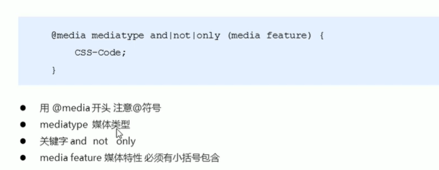
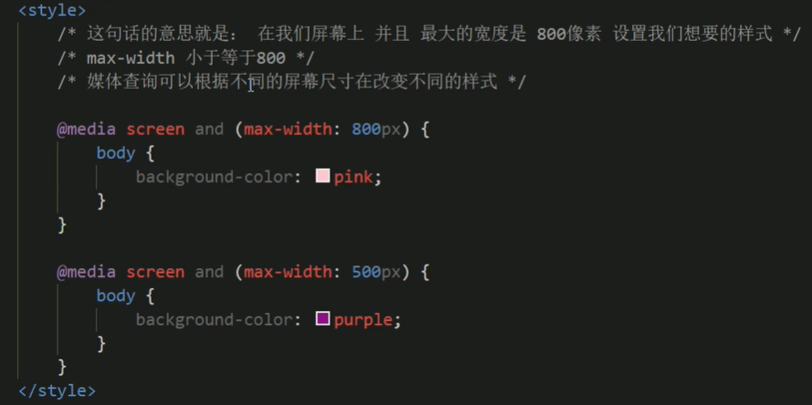
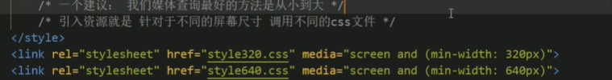
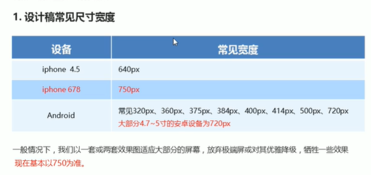

1. rem是 root em的简称
2. em是父元素的字体大小
3. rem是相对于[html元素]的字体大小
html{
    font-size:14px
}
4. rem的优势：统一了根元素，相当于是一个标准
5. 媒体查询
   
   - @media可以针对不同的屏幕尺寸设置不同的样式
   - 目前很多苹果手机、Android手机、平板等设备都会用到多媒体查询
   - all所有设备
   - print打印设备
   - screen手机电脑
  
6. 引入资源（不同的屏幕用不同的css文件）
   - 当屏幕大于640px 显示2个div
   - 当屏幕小于640px 显示1个div
   - 
  

# rem适配方案
## rem实际开发方案
1. less+媒体查询+rem
2. flexible.js+rem(推荐使用)
3. 
4. 首先选一个标准像素，一般是750px
5. rem = 元素元素值/（屏幕宽度/划分的分数）