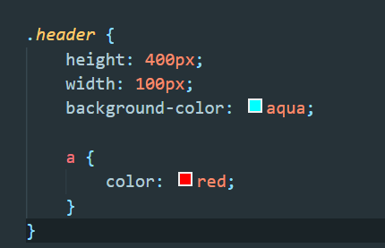

# less基础
## css弊端
1. 代码没有逻辑
2. 没有很好的计算能力
3. 难以维护
## less解决前面的弊端
1. less是一门css拓展语言，也叫css预处理器，在现有的css语法上加入了程序式语言的特性。比如：变量，混入，运算以及函数功能大大简化了css的维护成本。
## less语法
1. @变量名：值；
2. 不能数字开头，区分大小写
3. less文件转化为css才能使用,easy less插件可以转换
4. 选择器可以嵌套使用
   - 
5. &：hover   &：：before 交集选择器 伪类和伪元素的写法
6. less运算：
   - @border:5px + 5;
   - @border:80 / 50rem;  1.6 rem
   - @border:5px * 5;
   - @border:5px - 5;
   - 运算符号两侧加空格
   - 两个不同的单位参与运算，以第一个变量的单位为准

  