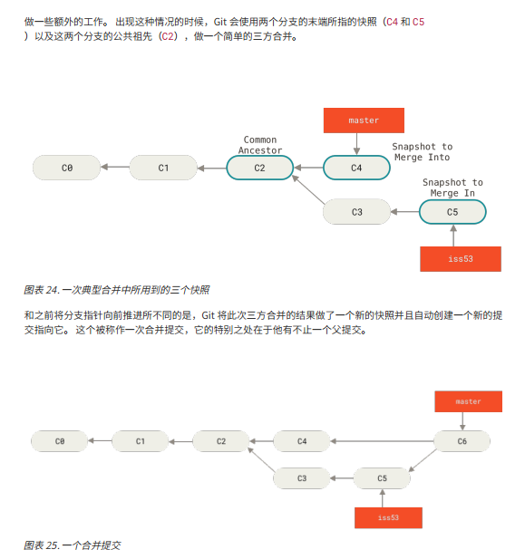

#git和github的一些总结

   --------------------------初试添加、提交操作-------------------------------------------

1. git init ：初始化git文件操作
2. git status 能查看不是当前路径下的工作区文件的改变
3. git add <filename> 只能add当前路径下的向缓存区文件(或者写全文件的路径)
4. git commit -m "提交的备注"(提交到本地的仓库了)
5. git push -u origin\master
6. git pull --rebase WEB_PROJECT master  出现拒绝访问的时候

   ---------------------------撤销操作----------------------------------------------------

1. git reset HEAD <filename> and git restore --staged <file_name> 来取消暂存，回到工作区
2. git checkout -- <filename>（逐渐会被淘汰，一个是分支的管理一个是文件的恢复，现在用switch和store） and git restore <file_name>  放弃对工作区的文件修改

   ---------------------------分支的管理--------------------------------------------------

1. git branch <分支名> ：创建分支
2. git switch <分支名> git checkout <分支名> ：切换分支
3. git checkout  -b <分支名> ：创建并切换分支
4. git branch -d <分支名>:删除分支
5. git merge <分支名>：合并<分支名>到master上面
6. 
7. git branch --merged 与 git branch --no-merged 这两个有用的命令可以过滤这个列表中已经合并或尚未合并到当前分支的分支